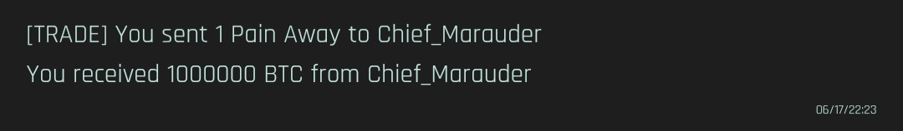


A leader's log documenting the first day of rebuilding Nousagi [NSG] on CyberCode Online.


If you asked me, *"How's the first day of being the leader of NSG?"*

Honestly, when I first stepped up, I didn't fully realize how much responsibility came with leading a gang.

That changed when I started sending direct messages to former and current NSG members on [Discord](https://discord.com). As I reached out to people, I realized that rebuilding the gang wasn't just about creating a new roster. We would also need to rebuild our resources, funds, and support network from the ground up.



If you've read my [previous announcement](/news/back-and-rebuilding) on June 16, you'll know that [Xythran](members/xythran) committed to helping me even before we officially re-established the gang in [CyberCode Online](https://cybercodeonline.com).

Yesterday, June 17, I reached out to [Homongji](members/jude) and asked if he could commit as well. He accepted my invitation, joined the game, and told me he could balance helping the gang alongside his studies.

I also spoke with [Chief_Marauder](members/chief_marauder).

While he said he wouldn't be joining the gang itself, he still offered to help with funds. Through a trade, he gave me **1,000,000 BTC**. Since direct transfers aren't possible, I had to trade him something in return, so I gave him a single [Pain Away™️](https://github.com/DexterHuang/CyberCodeOnline/blob/master/contribution/mobile/en/dungeon-lore/Pain_Away_Ad.md).

